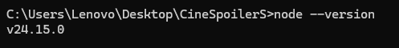
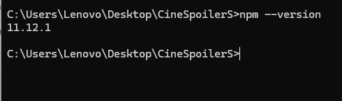
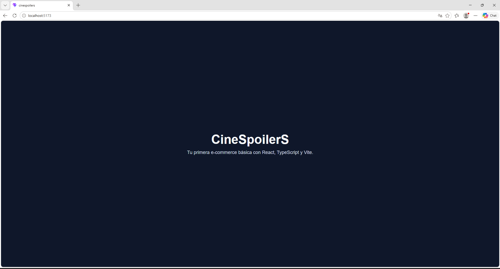
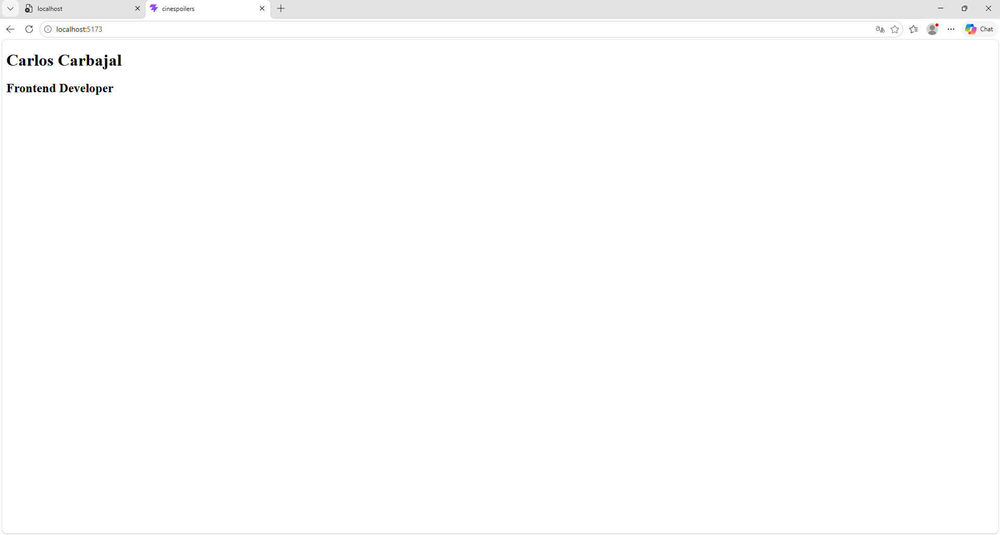
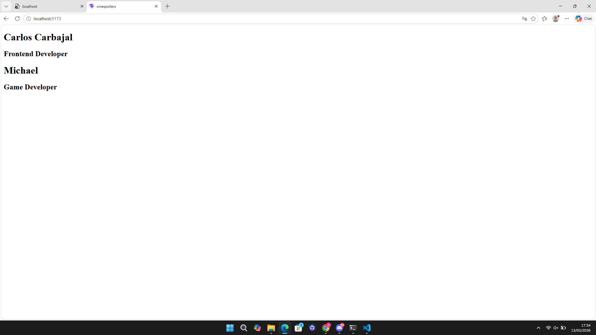

# 🎬 CineSpoilerS

**CineSpoilerS** es una aplicación web desarrollada con **React**, **TypeScript** y **Vite**.

Este proyecto representa la primera etapa de una aplicación e-commerce básica relacionada con productos de cine. En esta fase inicial se configuró el entorno de desarrollo, se creó el proyecto base y se realizaron cambios iniciales en la interfaz para dejar una base limpia, personalizada y preparada para futuras funcionalidades.

---

## 📌 Tabla de contenido

- [Descripción general](#-descripción-general)
- [Objetivo de esta etapa](#-objetivo-de-esta-etapa)
- [Tecnologías utilizadas](#-tecnologías-utilizadas)
- [Trabajo realizado](#-trabajo-realizado)
- [Evidencias del proyecto](#-evidencias-del-proyecto)
- [Instalación y ejecución](#-instalación-y-ejecución)
- [Estado actual](#-estado-actual)
- [Próximas etapas](#-próximas-etapas)
- [Autor](#-autor)

---

## 📖 Descripción general

**CineSpoilerS** será una aplicación e-commerce básica orientada a productos relacionados con el cine.

El propósito del proyecto es construir una base frontend moderna, ordenada y escalable utilizando **React con TypeScript**. Aunque actualmente el proyecto se encuentra en una etapa inicial, la estructura permitirá agregar progresivamente componentes, estilos globales, catálogo de productos, carrito de compras y una futura integración con pasarela de pagos.

En esta primera entrega se trabajó principalmente en la creación del proyecto, la verificación del entorno, la limpieza inicial de la interfaz y una personalización básica de la pantalla principal.

---

## 🎯 Objetivo de esta etapa

El objetivo principal de esta etapa fue preparar correctamente el proyecto inicial para comenzar el desarrollo de la aplicación.

Se buscó dejar una base limpia, funcional y entendible, evitando mantener elementos innecesarios de la plantilla por defecto de Vite.

---

## 🚀 Tecnologías utilizadas

En esta etapa se utilizaron las siguientes tecnologías:

- **React:** biblioteca principal para construir la interfaz de usuario.
- **TypeScript:** lenguaje utilizado para mejorar la seguridad y calidad del código mediante tipado.
- **Vite:** herramienta de desarrollo usada para crear y ejecutar el proyecto de manera rápida.
- **Node.js:** entorno necesario para ejecutar herramientas modernas de desarrollo frontend.
- **npm:** gestor de paquetes utilizado para instalar dependencias y ejecutar scripts.
- **Git:** sistema de control de versiones usado para registrar los avances del proyecto.
- **GitHub:** plataforma donde se alojará el repositorio del proyecto.

---

## 🧩 Trabajo realizado

Durante esta primera etapa se realizaron las siguientes actividades:

- Se verificó la instalación de **Node.js**.
- Se verificó la disponibilidad de **npm**.
- Se creó el proyecto usando **Vite + React + TypeScript**.
- Se instalaron las dependencias iniciales del proyecto.
- Se ejecutó el servidor de desarrollo.
- Se comprobó que React funciona correctamente en el navegador.
- Se eliminó el contenido inicial de ejemplo generado por Vite.
- Se personalizó la pantalla inicial con el nombre del proyecto **CineSpoilerS**.
- Se agregó el nombre del autor en la pantalla principal.
- Se organizó una carpeta `docs` para guardar las evidencias del avance.

---

## 🖼️ Evidencias del proyecto

En esta sección se muestran las evidencias principales de la primera etapa del proyecto **CineSpoilerS**.

El orden presentado es: verificación del entorno, creación del proyecto React, personalización inicial y limpieza de la aplicación.

---

## 1. Evidencias de instalación del entorno

### 1.1 Verificación de Node.js

Permite comprobar que **Node.js** está instalado correctamente en el equipo.  
Esta herramienta es necesaria para crear, instalar dependencias y ejecutar proyectos modernos desarrollados con React y Vite.



---

### 1.2 Verificación de npm

Permite comprobar que **npm** está disponible correctamente.  
npm se utiliza para instalar las dependencias del proyecto y ejecutar los comandos definidos en el archivo `package.json`.



---

## 2. Evidencia del proyecto React creado

### 2.1 Proyecto React con Vite funcionando

Permite evidenciar que el proyecto **CineSpoilerS** fue creado correctamente con **Vite + React + TypeScript** y que el servidor de desarrollo funciona en el navegador.


---

## 3. Evidencias de la interfaz inicial

### 3.1 Pantalla inicial personalizada

Permite evidenciar que la pantalla principal fue modificada para mostrar el nombre del proyecto **CineSpoilerS** y el nombre del autor.


---

### 3.2 Pantalla inicial limpia de CineSpoilerS

Permite evidenciar que se eliminó el contenido de ejemplo de Vite y se dejó una pantalla inicial personalizada para el proyecto **CineSpoilerS**.



---

### 3.3 Componente Profile agregado

Permite evidenciar que se creó y utilizó el componente `Profile`, separando la información del perfil del autor en un componente reutilizable dentro de la aplicación.



---

### 3.4 Componente Profile reutilizable con props

Permite evidenciar que el componente `Profile` fue mejorado para recibir información mediante props.  
De esta manera, el mismo componente puede mostrar diferentes perfiles sin duplicar estructura de código.



---

## ⚙️ Instalación y ejecución

### 1. Clonar el repositorio

```bash
git clone https://github.com/Gonnarch/React_Cinespoilers